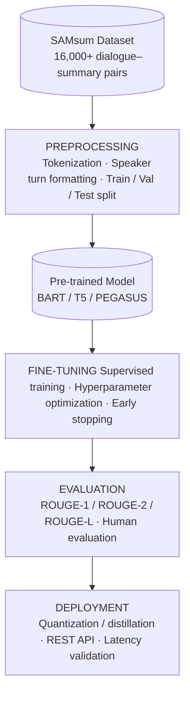

## 1. Problem Description

Imagine joining a morning standup and realizing the group chat moved fast overnight. Fifty-four unread messages, a few side threads, and somewhere in there the plan for today changed. You're not sure what was decided, so you spend the first ten minutes of your day catching up instead of contributing.

Modern messaging platforms — Microsoft Teams, Slack, Discord, WhatsApp, Telegram, and Signal — generate enormous volumes of group conversation daily. As threads grow longer, users must scroll through hundreds of messages just to locate a single action item, key decision, or update. This friction compounds across time zones and async workflows, where catching up is never optional.

>"56% of professionals report missing key updates — and for 30%, it happens often or very often."
— Pumble, State of Internal Communication, 2026

Microsoft's 2023 Work Trend Index found that 64% of employees don't have enough time and energy to do their work, with communication volume cited as a primary driver. Loom's 2023 survey of 1,500 workers found that 31% struggle to find time to work at all due to constant interruptions.

The consequences are predictable: important details get buried in noise, context is missed by anyone skimming quickly, and users disengage, duplicate work, or miss deadlines entirely. The root cause is structural — there is no intelligent layer between raw conversation and the information people actually need.

## 2. Impact Assessment

The consequences of conversation overload extend beyond individual frustration — they affect how users experience the platform, whether they stay, and how the platform competes.

### User Experience and Satisfaction
When users cannot quickly find what they need, the platform feels unreliable rather than helpful. Missed context leads to repeated questions, duplicated work, and avoidable misunderstandings — all of which erode trust in the platform as a dependable place to communicate. Over time, what should feel like a productivity tool begins to feel like another source of noise.

### User Retention and Engagement
Overload drives disengagement. Users who feel overwhelmed do not adapt — they mute channels, skim instead of read, or abandon the platform entirely. This quietly degrades the activity metrics that retention depends on. The problem compounds in larger teams and cross-timezone workflows, where the volume of missed conversation is highest and the cost of disengagement is most visible.

### Competitive Disadvantage
Platforms that surface information intelligently are raising the baseline expectation for what a messaging tool should do. Users now compare experiences across tools, and a platform without summarization or smart filtering forces users to do cognitive work that competing tools handle automatically. Without investment in this layer, the gap between what users expect and what the platform delivers will only widen.

## 3. Solution Vision

Automated dialogue summarization directly addresses the structural gap identified in the problem statement — the absence of an intelligent layer between raw conversation and the information users actually need.

### Reducing Cognitive Load
Rather than requiring users to read every message to reconstruct context, a summarization feature distills a conversation into its essential points — decisions made, actions assigned, and topics resolved. Users arrive informed, not exhausted.

### Making Conversations More Accessible
Summarization lowers the barrier to re-entry for users returning after time away, joining a thread mid-stream, or working across time zones. A concise summary replaces the anxiety of the unread count with a clear, immediate answer to the question: what did I miss?

### Enhancing the Platform's Value Proposition
A messaging platform that actively helps users manage information is meaningfully different from one that simply delivers it. Summarization transforms the platform from a passive channel into an intelligent workspace — one that respects users' time and attention.

### Creating Opportunities for Premium Features
Summarization is a foundation, not a ceiling. Once in place, it enables a range of higher-value features: scheduled digest summaries, searchable conversation highlights, smart notifications based on summary content, and per-user relevance filtering. These create clear opportunities for differentiated premium tiers.

### Proposed Solution
We will fine-tune a transformer-based model on the SAMsum dataset — a collection of 16,000+ human-written dialogue–summary pairs — to generate concise, fluent summaries of multi-turn conversations. Summaries are surfaced inline, giving users instant context without scrolling.

### Project goals

+ Reduce information overload — compress long threads into digestible summaries, cutting catch-up time significantly
+ Improve user engagement — lower the barrier to re-entry, keeping users active and informed without fatigue
+ Deliver AI-powered platform features — demonstrate a production-grade NLP capability that enhances the core product experience

## 4. Success Criteria

Success will be evaluated across three dimensions: model quality, user impact, and technical performance.

### Model Quality
Summarization quality will be measured using ROUGE scores against human-written reference summaries from the SAMsum test set. Target benchmarks are:
+ ROUGE-1: ≥ 0.45 — measures unigram overlap between generated and reference summaries
+ ROUGE-2: ≥ 0.21 — measures bigram overlap, capturing fluency and phrase accuracy
+ ROUGE-L: ≥ 0.40 — measures longest common subsequence, reflecting overall readability

These targets are informed by published baselines on the SAMsum dataset for models such as BART and PEGASUS.

### User Impact
Beyond automated scoring, model quality will be validated through human evaluation. A sample of generated summaries will be rated by human evaluators on accuracy, completeness, and conciseness. On the platform side, success will be tracked through:
+ Reduction in average time spent scrolling before contributing to a thread
+ Increase in re-engagement rate for users returning to high-volume channels
+ User satisfaction scores collected via in-product feedback on summary quality

### Technical Performance
For summarization to be useful it must be fast enough to feel seamless. Performance requirements are:

+ Summary generation latency of under 2 seconds for conversations up to 100 messages
+ Model inference cost within budget thresholds suitable for production deployment
+ Scalability to handle concurrent summarization requests without degradation

## 5. Sources

- Pumble. *State of Internal Communication 2026*. https://pumble.com/learn/communication/communication-statistics/

- Microsoft. *Work Trend Index Annual Report: Will AI Fix Work?* 2023. https://www.microsoft.com/en-us/worklab/work-trend-index/will-ai-fix-work

- Loom. *New Data: Workers Spend Almost Half Their Day Communicating*. 2023. https://www.globenewswire.com/news-release/2023/04/27/2656566/0/en/New-Data-Workers-Spend-Almost-Half-Their-Day-Communicating-Making-It-Difficult-To-Actually-Get-Work-Done.html

# Problem Solving Process

## 1. Process Framework

**Step 1 — Data Exploration and Preparation**
+ Explore the SAMsum dataset to understand dialogue length distributions, summary styles, and vocabulary.
+ Clean and preprocess the data by tokenizing dialogues and summaries, handling speaker turn formatting, and splitting into train, validation, and test sets.
+ Identify and address any quality issues such as inconsistent formatting or outlier lengths.

**Step 2 — Model Architecture Selection**
+ Evaluate candidate transformer architectures — BART, T5, and PEGASUS — based on their performance on dialogue summarization benchmarks.
+ Select the most appropriate model based on ROUGE baselines, inference speed, and resource requirements.
+ Establish a baseline by evaluating the pre-trained model on the SAMsum test set before any fine-tuning.

**Step 3 — Fine-Tuning and Implementation**
+ Fine-tune the selected pre-trained model on the SAMsum training set.
+ Configure hyperparameters including learning rate, batch size, and maximum sequence length.
+ Apply techniques such as gradient accumulation and mixed precision training to manage resource constraints efficiently.

**Step 4 — Optimization**
+ Apply optimization strategies to improve summary quality and efficiency. This includes beam search tuning for generation quality, length penalty adjustment to control summary verbosity, and early stopping to prevent overfitting.
+ Evaluate on the validation set iteratively to guide optimization decisions.

**Step 5 — Evaluation and Testing**
+ Evaluate the fine-tuned model on the SAMsum test set using ROUGE-1, ROUGE-2, and ROUGE-L scores.
+ Supplement automated evaluation with human assessment of summary accuracy, completeness, and fluency. Compare results against the pre-fine-tuning baseline and published benchmarks.

**Step 6 — Deployment Considerations**
+ Optimize the model for inference using quantization or distillation where appropriate.
+ Wrap the model in a REST API for integration with messaging platform infrastructure.
+ Define latency, throughput, and cost requirements and validate that the deployed model meets them under realistic load conditions.

---

## 2. Conceptual Representation

---

## 3. Methodology Justification

### Why a BERT-based Encoder-Decoder Architecture

Dialogue summarization requires understanding the full context of a conversation before generating a summary — a task that maps naturally to an encoder-decoder architecture. The encoder processes the entire input dialogue, capturing meaning across speaker turns and long-range dependencies. The decoder then generates a fluent, abstractive summary rather than simply extracting sentences. Models like BART and T5 are built on this architecture and have demonstrated strong performance on conversational summarization benchmarks, making them well suited to the SAMsum task.

### Fine-tuning vs. Training from Scratch

Pre-trained transformer models have already learned rich representations of language from large corpora. Fine-tuning leverages this foundation, requiring only a fraction of the data and compute that training from scratch would demand. For a dataset of 16,000 examples, training from scratch would likely result in underfitting. Fine-tuning allows the model to adapt its existing language understanding to the specific style and structure of dialogue summaries efficiently and reliably.

### Why ROUGE and Human Evaluation

ROUGE scores provide a fast, reproducible, and widely benchmarked measure of summarization quality by comparing n-gram overlap between generated and reference summaries. This makes it straightforward to compare results against published baselines. However, ROUGE alone does not capture fluency, coherence, or factual accuracy. Human evaluation complements ROUGE by assessing qualities that automated metrics miss, ensuring that summaries are not only statistically similar to references but genuinely useful to readers.

### Optimization Techniques

Beam search decoding improves summary quality over greedy decoding by exploring multiple candidate sequences simultaneously. Length penalty prevents the model from generating summaries that are too short to be informative or too long to be practical. Mixed precision training reduces memory usage and speeds up training without meaningful loss in model quality. Together these techniques balance output quality with the computational constraints of production deployment.

---

## 4. Alignment with Requirements

### Project Deliverables

The process framework directly maps to each project deliverable: data exploration and preparation produce a clean, well-understood dataset; fine-tuning produces a trained model; evaluation produces quantitative ROUGE scores and qualitative human judgments; and deployment considerations produce a model ready for integration.

### Core Business Needs

The approach addresses the core business need — reducing information overload — by producing summaries that are concise, accurate, and generated fast enough to be surfaced inline. Every technical decision, from architecture selection to latency requirements, is grounded in the practical constraint that the feature must be useful to real users in real time.

### Balancing Technical Performance with Practicality

Fine-tuning a pre-trained model rather than building from scratch keeps the project within realistic resource and time constraints. Optimization steps such as quantization and distillation ensure that model quality is not achieved at the expense of deployment feasibility. The evaluation framework — combining ROUGE with human assessment — ensures that technical performance translates into genuine user value.

### Meaningful Business Outputs

The outputs of this project are not academic artifacts. ROUGE scores establish credibility and comparability. Human evaluation scores reflect real user experience. A deployed REST API makes the summarization capability accessible to platform engineers. Together they form a complete, production-oriented deliverable that advances both the technical and business goals of the project.

# Timeline and Scope

| Phase | Dates | Key Tasks |
|---|---|---|
| Research & Preparation | 5/6 - 5/11 | Lit review, dataset acquisition, pipeline sketch |
| Data Preprocessing | 5/6 - 5/11 | EDA, tokenization, formatting |
| Model Architecture | 5/12 - 5/19 | Configure model, implement decoder, wire pipeline |
| Integration Review | 5/20 - 5/24 | End-to-end test, baseline ROUGE |
| Training & Optimization | 5/25 - 6/1 | Training loop, ROUGE tracking, batch processing |
| Evaluation & Analysis | 6/2 - 6/9 | Hyperparameter tuning, ROUGE eval, human review |
| Documentation | 6/11 - 6/13 | Write-up, diagrams, presentation |

## 1. Research and Preparation Phase
**[5/6/26 - 5/11/26] — ~12 hours**

- Literature review of dialogue summarization and transformer-based encoder-decoder architectures
- Acquire SAMsum dataset and conduct initial exploration of conversation structure, length distributions, and summarization patterns
- Sketch preprocessing pipeline and confirm model architecture direction (BART, T5, or PEGASUS)

---

## 2. Implementation Phases

**Data Preprocessing and Exploration [5/6/26 - 5/11/26]**
- ✅ EDA — conversation lengths, turn counts, summary quality, length distributions
- ✅ Raw dialogues cleaned, tokenized, and formatted for sequence-to-sequence input (truncation, padding)

**Model Architecture Implementation [5/12/26 - 5/19/26]**
- ✅ Configure pre-trained encoder-decoder model (BART / T5 / PEGASUS)
- ✅ Implement decoder and attention mechanisms
- ✅ Wire together full sequence-to-sequence pipeline

**Integration and Pre-training Review [5/20/26 - 5/24/26]**
- ✅ End-to-end pipeline test on a small data sample
- ✅ Validate tokenization, input formatting, and output generation
- ✅ Confirm baseline ROUGE scores before fine-tuning begins

**Training Setup and Optimization [5/25/26 - 6/1/26]**
- ✅ Training loop implementation
- ✅ ROUGE score tracking across epochs
- ✅ Batch processing, gradient accumulation, mixed precision training

**Evaluation and Analysis [6/2/26 - 6/9/26]**
- [ ] Hyperparameter tuning — learning rate, batch size, decoding parameters
- [ ] ROUGE-1, ROUGE-2, ROUGE-L evaluation on test set
- [ ] Human evaluation of summary quality

**Documentation and Reporting [6/11/26 - 6/13/26]**
- [ ] Technical write-up
- [ ] Results analysis
- [ ] Architectural diagrams
- [ ] Presentation materials

---

## 3. Iteration Points

**After initial training run (~ 6/1/26)**
Review validation loss curves and ROUGE scores. If results fall below target thresholds, adjust learning rate, batch size, or decoding parameters before the full evaluation phase begins.

**After evaluation (~ 6/9/26)**
Incorporate feedback from project critiques into the final write-up. If ROUGE scores are unsatisfactory, explore alternative pre-trained checkpoints or decoding strategies such as adjusted beam search width or length penalty.

**Contingency (6/10/26)**
One unscheduled day before documentation begins, reserved for unexpected issues surfaced during evaluation or feedback incorporation.

---

## 4. Risk Management

**Computational Intensity**

The primary technical risk is computational intensity during model training. Although the SAMsum dataset is a manageable 16,000 rows, fine-tuning a transformer-based encoder-decoder is resource-intensive by nature: the encoder runs a full forward pass over every token in every conversation, and training requires storing gradients and activations for backpropagation across both encoder and decoder. Dialogue inputs also tend to be long, compounding per-sample cost across multiple training epochs.

The following mitigations are built into the project plan:

- **Input truncation** — capping conversation length at 512 tokens to control per-sample compute cost without significantly degrading summary quality
- **Checkpoint saving** — model weights saved at regular intervals to prevent full training restarts in the event of interruption or hardware failure
- **Fallback configuration** — if training time exceeds estimates, a smaller pre-trained checkpoint (bart-base rather than bart-large, or t5-small rather than t5-base) will be used as a drop-in alternative
- **Front-loaded architecture decisions** — finalizing the model design during the architecture phase (5/12/26 - 5/19/26) ensures no architectural uncertainty delays the training run when compute time is most constrained

**Secondary Risks**

Unexpected data quality issues may be surfaced during preprocessing, and technical roadblocks may arise during decoder implementation. Approximately 6 hours of unallocated time in the final week serves as contingency for either. The unscheduled day on 6/10/26 and lightly scheduled weekends throughout preserve additional buffer capacity.

---

## 5. Final Delivery

- [ ] Final implementation completion — **6/9/26**
- [ ] Project critique submission — **6/10/26 - 6/11/26**
- [ ] Documentation and presentation preparation — **6/11/26 - 6/13/26**
- [ ] Final submission — **6/14/26**
